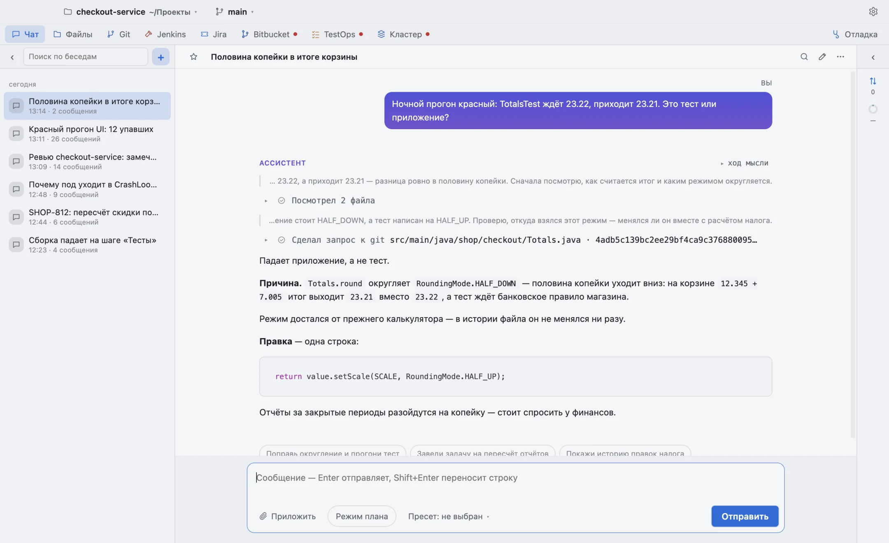
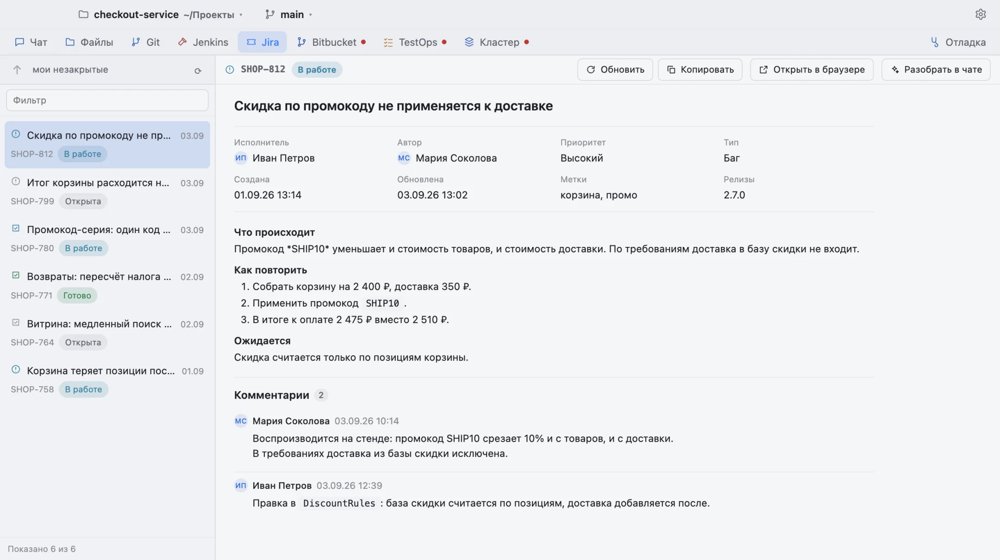
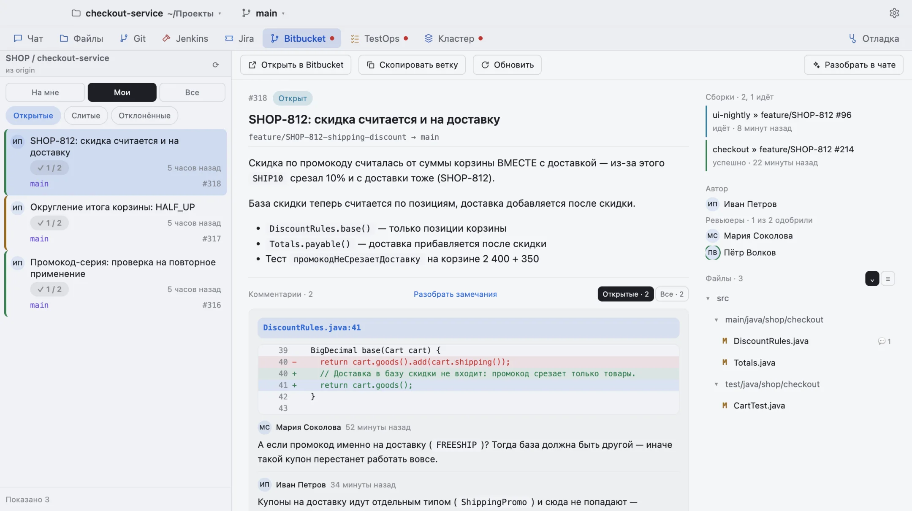
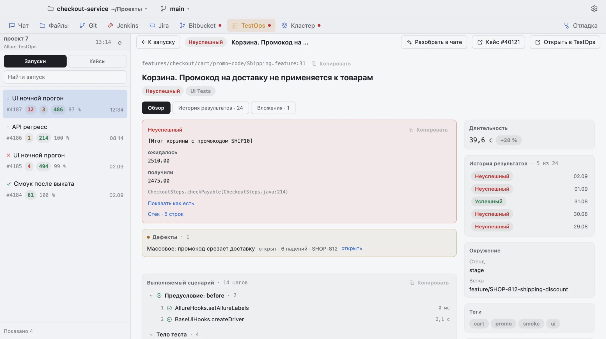
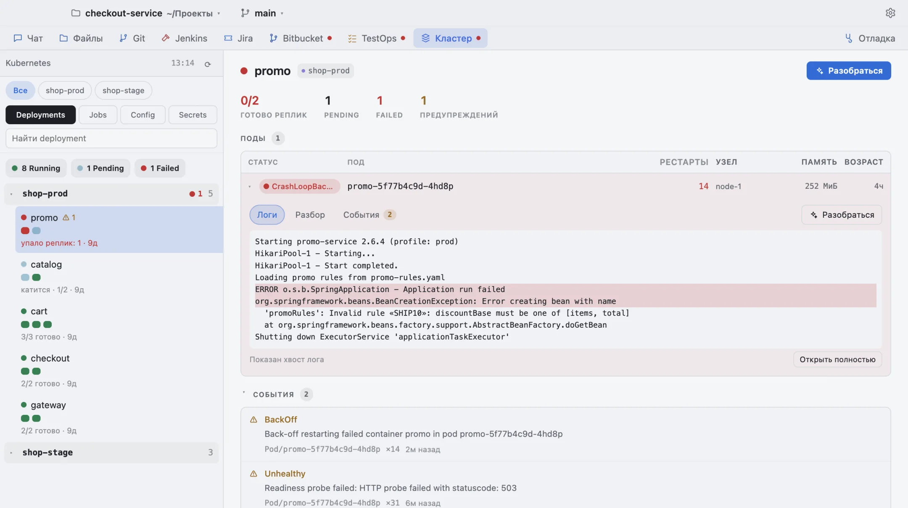

<p align="center">
  
</p>

<h1 align="center">ImpAgent</h1>

<p align="center">
  <b>Разбирается в задаче, а не пересказывает её.</b><br />
  Чат с моделью, файлы, шелл и git — а рядом Jira, Confluence, Bitbucket, Jenkins,
  TestOps и Kubernetes, в одном окне.
</p>

<p align="center">
  <a href="../../releases/latest"></a>
  
</p>

<p align="center">
  <a href="../../releases/latest"><b>Скачать</b></a> ·
  <a href="https://ilyabazhenov.github.io/imp-agent-crossplatform-releases/"><b>Сайт</b></a> ·
  <a href="README.md">English version</a>
</p>

<p align="center">
  <picture>
    <source media="(prefers-color-scheme: dark)" srcset="docs/shots/chat-dark.webp" />
    
  </picture>
</p>

Приложение работает **по лицензии, привязанной к компьютеру**: после установки окно
покажет код машины — пришлите его, и в ответ придёт строка активации.

## Не только чат

<table>
  <tr>
    <td width="50%"><picture><source media="(prefers-color-scheme: dark)" srcset="docs/shots/jira-dark.webp" /></picture><br /><sub><b>Jira</b> — задача с описанием и комментариями</sub></td>
    <td width="50%"><picture><source media="(prefers-color-scheme: dark)" srcset="docs/shots/bitbucket-dark.webp" /></picture><br /><sub><b>Bitbucket</b> — пул-реквест с диффом и замечаниями</sub></td>
  </tr>
  <tr>
    <td width="50%"><picture><source media="(prefers-color-scheme: dark)" srcset="docs/shots/testops-dark.webp" /></picture><br /><sub><b>TestOps</b> — упавший прогон</sub></td>
    <td width="50%"><picture><source media="(prefers-color-scheme: dark)" srcset="docs/shots/kube-dark.webp" /></picture><br /><sub><b>Kubernetes</b> — под в CrashLoopBackOff, его события и лог</sub></td>
  </tr>
</table>

## macOS

Выберите файл под свой компьютер:

- **Apple Silicon** (M1 и новее) — `ImpAgent-<версия>-arm64-mac.zip`
- **Intel** — `ImpAgent-<версия>-mac.zip`

Распакуйте двойным щелчком и перетащите ImpAgent в «Программы».

Приложение подписано самодельным сертификатом — Apple о нём не знает, поэтому macOS
при первом запуске скажет, что приложение повреждено. Это не так: система просто не берётся
ручаться за незнакомого издателя. Один раз выполните в Терминале:

```bash
xattr -dr com.apple.quarantine /Applications/ImpAgent.app
```

Повторять это не придётся: карантин вешает браузер на скачанный файл, а обновления
приложение скачивает само.

Ставить нужно именно в `/Applications` — иначе обновлению некуда будет записать новую
версию.

## Windows

Скачайте `ImpAgent Setup <версия>.exe`. Установщик не подписан, поэтому SmartScreen
покажет синее окно «Windows защитила ваш компьютер» — нажмите «Подробнее», затем
«Выполнить в любом случае». Права администратора не нужны.

## Обновления

Приложение проверяет новые версии само и предлагает поставить их одним нажатием.
Установка — это перезапуск: незавершённый ход оборвётся, беседы останутся на месте.

## Лицензия

Проверка идёт **офлайн** — приложению не нужен ни лицензионный сервер, ни интернет
для запуска. Код машины виден на экране активации (кнопка «Скопировать») и в настройках,
вкладка «Лицензия». Лицензия действует включительно по указанный день; продлить её можно
заранее, не дожидаясь блокировки.
